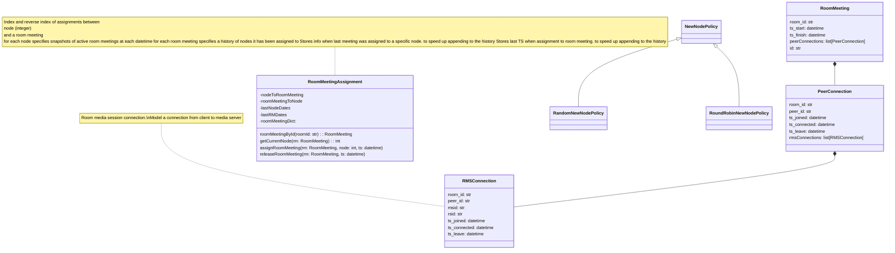

# rolling_update_downtime

```mermaid
classDiagram


    note for RMSConnection "Room media session connection.\nModel a connection from client to media server"
    class RMSConnection {
        room_id: str
        peer_id: str
        msid: str
        rsid: str
        ts_joined: datetime
        ts_connected: datetime
        ts_leave: datetime
    }
    class PeerConnection {
        room_id: str
        peer_id: str
        ts_joined: datetime
        ts_connected: datetime
        ts_leave: datetime
        rmsConnections: list[RMSConnection]
    }
    class RoomMeeting {
        room_id: str
        ts_start: datetime
        ts_finish: datetime
        peerConnections: list[PeerConnection]
        id: str
    }
    
    PeerConnection *-- RMSConnection
    RoomMeeting *-- PeerConnection
    
    note for RoomMeetingAssignment "Index and reverse index of assignments between
    node (integer)
    and a room meeting
    
    for each node specifies snapshots of active room meetings at each datetime
    for each room meeting specifies a history of nodes it has been assigned to
    
    Stores info when last meeting was assigned to a specific node. to speed up appending to the history
    Stores last TS when assignment to room meeting. to speed up appending to the history " 
    class RoomMeetingAssignment {
        -nodeToRoomMeeting
        -roomMeetingToNode 
        
        -lastNodeDates
        -lastRMDates
        
        -roomMeetingDict: 
        
        roomMeetingById(roomId: str): RoomMeeting
        getCurrentNode(rm: RoomMeeting): int
        assignRoomMeeting(rm: RoomMeeting, node: int, ts: datetime)
        releaseRoomMeeting(rm: RoomMeeting, ts: datetime)
    }
    
    NewNodePolicy <|-- RandomNewNodePolicy
    NewNodePolicy <|-- RoundRobinNewNodePolicy
    class NewNodePolicy {
    }
    class RandomNewNodePolicy {
    }
    class RoundRobinNewNodePolicy {
    }
```
