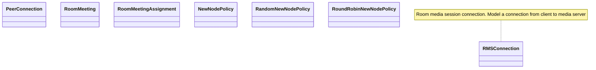

# rolling_update_downtime

```mermaid
classDiagram
  note for RMSConnection "Room media session connection. Model a connection from client to media server"

  class RMSConnection {
  }
  class PeerConnection {
  }
  class RoomMeeting {
  }
  class RoomMeetingAssignment {
  }
  class NewNodePolicy {
  }
  class RandomNewNodePolicy {
  }
  class RoundRobinNewNodePolicy {
  }
```
